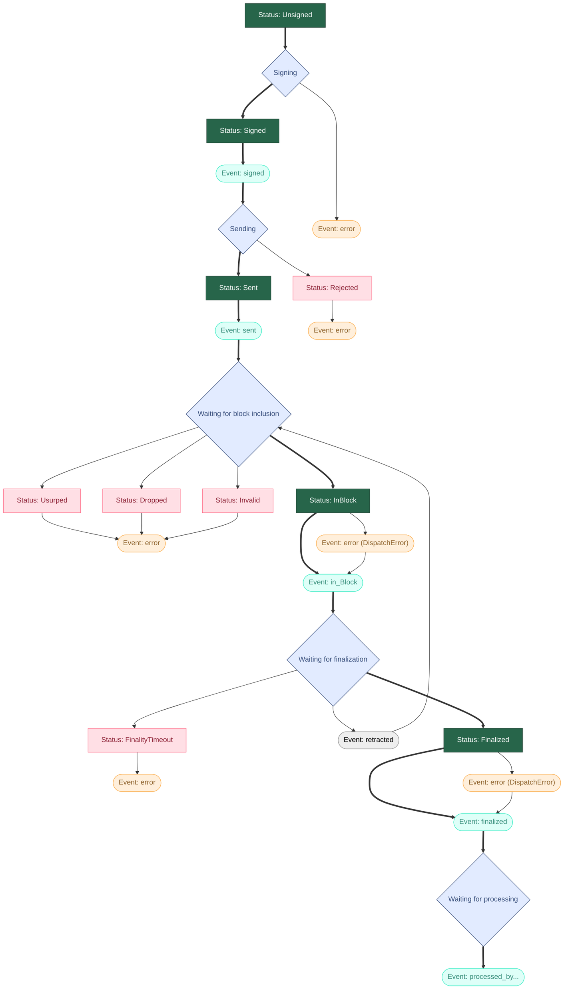

```mermaid
---
config:
  look: classic
  layout: dagre
---

flowchart TB
S_Un["Status: Unsigned"] ==> A_Si{"Signing"}
A_Si ==> S_Si["Status: Signed"]
S_Si ==> E_Si(["Event: signed"])
E_Si ==> A_Se{"Sending"}
A_Se ==> S_Se["Status: Sent"]
S_Se ==> E_Se(["Event: sent"])
E_Se ==> A_Bl{"Waiting for block inclusion"}
A_Bl ==> S_Bl["Status: InBlock"]
S_Bl ==> E_Bl(["Event: in_Block"])
E_Bl ==> A_Fi{"Waiting for finalization"}
A_Fi ==> S_Fi["Status: Finalized"]
S_Fi ==> E_Fi(["Event: finalized"])
E_Fi ==> A_Pr{"Waiting for processing"}
A_Pr ==> E_Pr(["Event: processed_by..."])
A_Si --> E_Si_er(["Event: error"])
A_Se --> S_Re["Status: Rejected"]
S_Re --> E_Se_er(["Event: error"])
A_Bl --> S_Us["Status: Usurped"] & S_Dr["Status: Dropped"] & S_Iv["Status: Invalid"]
S_Us --> E_Bl_er(["Event: error"])
S_Dr --> E_Bl_er
S_Iv --> E_Bl_er
A_Fi --> E_Re(["Event: retracted"]) & S_Ft["Status: FinalityTimeout"]
E_Re --> A_Bl
S_Ft --> E_Fi_er(["Event: error"])
S_Bl --> E_Bl_de(["Event: error (DispatchError)"])
E_Bl_de --> E_Bl
S_Fi --> E_Fi_de(["Event: error (DispatchError)"])
E_Fi_de --> E_Fi
E_Si_er ~~~ S_Re
E_Bl_er ~~~ S_Ft
A_Si:::Sky
S_Un:::Pine
S_Si:::Pine
E_Si:::Aqua
A_Se:::Pine
A_Se:::Sky
S_Se:::Pine
E_Se:::Aqua
A_Bl:::Sky
S_Bl:::Pine
E_Bl:::Aqua
A_Fi:::Sky
S_Fi:::Pine
E_Fi:::Aqua
A_Pr:::Sky
E_Pr:::Aqua
E_Si_er:::Peach
S_Re:::Rose
E_Se_er:::Peach
S_Us:::Rose
S_Dr:::Rose
S_Iv:::Rose
E_Bl_er:::Peach
E_Re:::Ash
S_Ft:::Rose
E_Fi_er:::Peach
E_Bl_de:::Peach
E_Fi_de:::Peach
classDef Pine stroke-width:1px, stroke-dasharray:none, stroke:#254336, fill:#27654A, color:#FFFFFF
classDef Peach stroke-width:1px, stroke-dasharray:none, stroke:#FBB35A, fill:#FFEFDB, color:#8F632D
classDef Sky stroke-width:1px, stroke-dasharray:none, stroke:#374D7C, fill:#E2EBFF, color:#374D7C
classDef Aqua stroke-width:1px, stroke-dasharray:none, stroke:#46EDC8, fill:#DEFFF8, color:#378E7A
classDef Rose stroke-width:1px, stroke-dasharray:none, stroke:#FF5978, fill:#FFDFE5, color:#8E2236
classDef Ash stroke-width:1px, stroke-dasharray:none, stroke:#999999, fill:#EEEEEE, color:#000000
```
